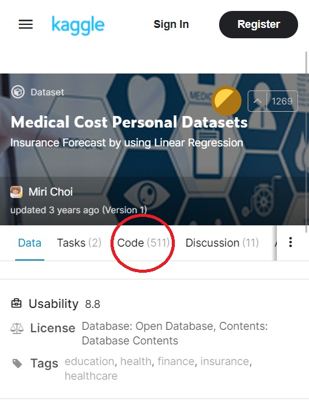
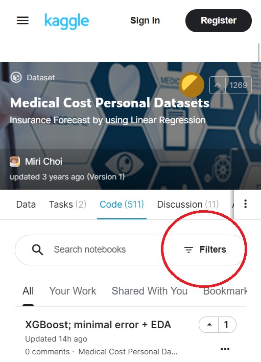
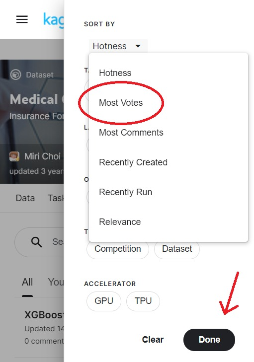
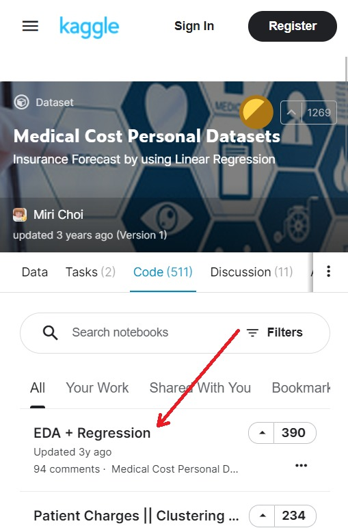
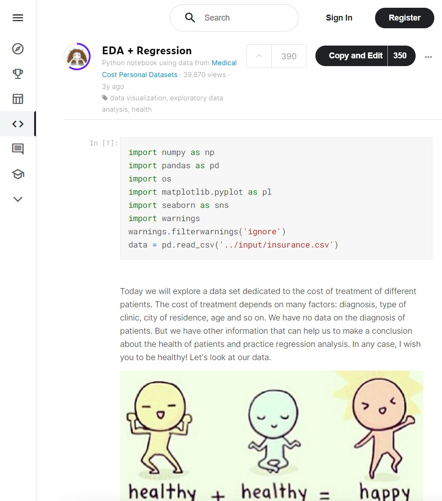

# Kaggle

https://www.kaggle.com/

Kaggle 本身係一個俾人 challenge 嘅網。
有好多 dataset / task， e.g. 圖案識別 / 人像識別 / XX 預測。

但佢就因為好多人用, 又有人分享佢哋啲 code，所以你可以跟人哋啲 code 玩。

    
    
    
    
    
    

Reference:

1. https://www.kaggle.com/mirichoi0218/insurance
2. https://www.kaggle.com/hely333/eda-regression
